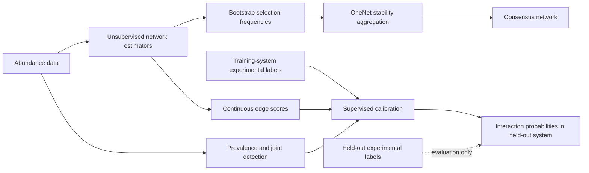

# Supervised Calibration of Unsupervised Microbiome Network Scores with Partial Experimental Measurements

## Paper concept

Microbiome network estimators can assign useful continuous evidence to taxon pairs even when their native graph-selection procedures produce graphs with very different densities. This project asks whether experimentally supported microbial interactions can be predicted more accurately by calibrating those scores with experimental training data.

The proposed framework combines:

- Continuous scores from multiple unsupervised network estimators
- Edge stability across resampled abundance tables
- Taxon prevalence and pairwise joint detection
- Experimentally measured interactions from independent training systems

The fitted model produces an interaction probability for every experimentally tested pair in a held-out system.

## Central hypothesis

> Experimental interactions become more predictable when unsupervised network scores are interpreted in light of taxon prevalence and joint detection.

This hypothesis does not require abundance-table sparsity to equal ecological-network sparsity. Prevalence and joint detection describe the information supporting an edge and may change how much confidence should be placed in an estimator score.

## Conceptual figure

The conceptual contrast is the location of experimental information. OneNet does not use experimental truth. The proposed method uses labels from training systems while keeping the held-out system's labels unavailable until evaluation.

## Primary research questions

1. Does supervised calibration improve recovery of experimentally supported interactions over individual unsupervised estimators?
2. Do prevalence and joint-detection features improve the interpretation of network scores?
3. Does calibration transfer to a held-out microbial system?
4. Does performance depend on the experimental definition of an interaction?
5. How much improvement comes from estimator combination, prevalence information, and organism traits?

## Initial analysis sequence

1. Audit which taxon pairs were experimentally tested in all five benchmarks.
2. Preserve tested neutral, positive, untested, signed, and directional outcomes.
3. Export continuous scores from the existing network estimators.
4. Add SPRING and SparCC score generators. Record methods that fail the common fitting procedure.
5. Construct one pair-feature table per experimental system.
6. Fit a regularized logistic calibration model using leave-one-system-out validation.
7. Compare against individual methods, mean-rank consensus, majority vote, prevalence-only prediction, and OneNet.
8. Report AUPRC and probability calibration before selecting any graph threshold.

## Initial ablation study

The first supervised comparison will contain four models:

1. Network scores only
2. Prevalence and zero-pattern features only
3. Network scores plus prevalence features
4. Network scores plus prevalence and organism features, where reliable metadata are available

The comparison between models 1 and 3 is the primary test of the prevalence-calibration hypothesis.

## Leave-one-system-out dimensions

Using the conservative 1,894-row table, the initial model will contain 1,617 experimentally supported interactions and 277 tested neutral pairs. The proposed analytical table and potential columns are:

| Table component | Rows | Potential columns | Number of columns in compact table |
|---|---:|---|---:|
| Identifiers and provenance | 1,894 | `dataset`, `study_id`, `taxon_1`, `taxon_2`, `truth_type`, `experimental_setting`, `label_rule`, `tested_status`, `mixed_evidence`, `n_evidence` | 10 |
| Response and experimental effects | 1,894 | `interaction_label`, `effect_sign`, `direction`, `effect_strength` | 4 |
| Network score predictors | 1,894 | Score percentile and selected edge indicator for PLNNetwork, GLMNet, SPIEC-EASI, SPRING, and SparCC; stability for SPIEC-EASI and SPRING | 12 |
| Prevalence predictors | 1,894 | `prevalence_1`, `prevalence_2`, `prevalence_min`, `prevalence_max`, `joint_prevalence`, `n_joint_positive`, `presence_jaccard` | 7 |
| Study descriptors | 1,894 | `n_samples`, `n_taxa`, `overall_zero_frequency`, `measurement_scale` | 4 |
| **Compact analytical table** | **1,894** | **Identifiers, responses, predictors, and study descriptors** | **37** |
| **Primary model matrix, `X`** | **1,894** | **12 network scores, 7 prevalence features, and 3 numerical study features** | **22** |
| **Primary response, `Y`** | **1,894** | **`interaction_label`** | **1** |

The compact analytical table has 37 columns. The primary supervised model uses 22 numerical predictors. Identifier, provenance, auxiliary response, and categorical study columns remain available for grouping, auditing, and secondary analyses. Additional raw scores and bootstrap summaries may expand the analytical table without changing its 1,894-row grain.

The working label distribution is:

| Dataset | Tested-pair rows | Positive interactions | Tested neutrals | Candidate model role |
|---|---:|---:|---:|---|
| OMM12 | 66 | 66 | 0 | Positive-recovery benchmark; cannot train a binary model alone |
| OMM12 keystone | 27 | 25 | 2 | Training or held-out evaluation after excluding `KB18` |
| PairInteraX | 1,687 | 1,441 | 246 | Main source of labeled pairs; 136 mixed-evidence pairs excluded |
| Butyrate assembly | 104 | 76 | 28 | Training or held-out evaluation |
| Host fitness | 10 | 9 | 1 | Small external system and directional sensitivity analysis |
| **Total** | **1,894** | **1,617** | **277** | **Combined conservative table** |

These counts are working estimates and will be finalized after taxon harmonization and reconstruction of the tested-pair tables.

The corresponding validation folds are:

| Held-out system | Training rows | Test rows |
|---|---:|---:|
| OMM12 | 1,828 | 66 |
| OMM12 keystone | 1,867 | 27 |
| PairInteraX | 207 | 1,687 |
| Butyrate assembly | 1,790 | 104 |
| Host fitness | 1,884 | 10 |
| OMM12 and OMM12 keystone together | 1,801 | 93 |

Each row represents one experimentally tested undirected taxon pair. Untested pairs are retained in the benchmark manifest but excluded from ordinary supervised binary training.

### Identifiers and provenance

These columns identify the observation and are not ordinary numerical predictors:

| Column | Description |
|---|---|
| `dataset` | Benchmark identifier |
| `study_id` | Experimental study or source |
| `taxon_1` | First taxon in deterministic pair order |
| `taxon_2` | Second taxon in deterministic pair order |
| `truth_type` | Pairwise, dropout, assembly, host fitness, or other truth definition |
| `experimental_setting` | Medium, host, treatment, or other available setting |
| `label_rule` | Rule used to distinguish an interaction from a tested neutral pair |
| `tested_status` | Positive, tested neutral, ambiguous, or untested |
| `mixed_evidence` | Whether source observations disagree after aggregation |
| `n_evidence` | Number of experimental observations supporting the pair label |

### Response columns

| Column | Description |
|---|---|
| `interaction_label` | Primary binary response: 1 for an interaction and 0 for a tested neutral pair |
| `effect_sign` | Positive, negative, conflicting, or unavailable |
| `direction` | Source-to-target direction when available |
| `effect_strength` | Experimental effect magnitude on its documented source scale |

The first model uses `interaction_label`. Sign and direction will be analyzed as separate outcomes when enough compatible labels are available.

### Unsupervised network score columns

For each method, retain the raw signed score when it is meaningful and construct comparable evidence summaries. Initial methods are PLNNetwork, GLMNet neighborhood selection, SPIEC-EASI, SPRING, and SparCC.

| Column pattern | Description |
|---|---|
| `<method>_score` | Raw signed edge weight or association estimate |
| `<method>_abs_score` | Absolute edge strength |
| `<method>_score_percentile` | Within-system percentile of absolute edge strength |
| `<method>_selected` | Indicator that the method selected the edge |
| `<method>_stability` | Selection fraction from SPIEC-EASI or SPRING resampling |
| `<method>_mean_bootstrap_score` | Mean signed score across resamples |
| `<method>_sd_bootstrap_score` | Score variability across resamples |
| `<method>_native_selected` | Indicator that the method's native procedure selected the edge |
| `<method>_entry_position` | Penalty or path position at which the edge first appears, when available |

The compact primary model will use these network predictors:

- Five score percentile columns
- Five selected edge indicators
- SPIEC-EASI stability
- SPRING stability

This contributes 12 predictors.

### Prevalence and observability columns

| Column | Description |
|---|---|
| `prevalence_1` | Fraction of samples containing taxon 1 |
| `prevalence_2` | Fraction of samples containing taxon 2 |
| `prevalence_min` | Lower of the two taxon prevalences |
| `prevalence_max` | Higher of the two taxon prevalences |
| `joint_prevalence` | Fraction of samples containing both taxa |
| `n_joint_positive` | Number of samples containing both taxa |
| `n_taxon_1_only` | Number containing taxon 1 without taxon 2 |
| `n_taxon_2_only` | Number containing taxon 2 without taxon 1 |
| `n_neither` | Number containing neither taxon |
| `presence_jaccard` | Jaccard similarity of pairwise presence patterns |
| `mean_positive_abundance_1` | Mean abundance of taxon 1 when detected |
| `mean_positive_abundance_2` | Mean abundance of taxon 2 when detected |
| `dispersion_1` | Documented abundance-dispersion measure for taxon 1 |
| `dispersion_2` | Documented abundance-dispersion measure for taxon 2 |

The compact primary model will initially use seven predictors: the two taxon prevalences, their minimum and maximum, joint prevalence, number jointly positive, and presence Jaccard similarity.

### Study descriptor columns

| Column | Description |
|---|---|
| `n_samples` | Number of usable abundance samples |
| `n_taxa` | Number of estimable taxa after filtering |
| `overall_zero_frequency` | Fraction of zero values in the cleaned abundance matrix |
| `measurement_scale` | Absolute abundance, count, relative abundance, or proportion |

The compact primary design matrix will therefore contain approximately 22 numerical predictors: 12 network evidence predictors, seven prevalence predictors, and three numerical study predictors. Optional biological features such as phylogenetic distance and metabolic complementarity will be added in a separate extension.

## Validation principle

All edges from a held-out experimental system remain together. Random edge splits are unsuitable because edges share taxa, environments, and experimental procedures. OMM12 and OMM12 keystone will also be held out together in a stricter validation analysis because they may share organisms and experimental provenance.

Experimental labels from the held-out system may be used only to calculate final performance.

## CoNet occurrence filter

Bootstrap resampling exposed a genuine CoNet limitation: taxa observed in very few samples can become all zero in a resample, which breaks its distance measures. I’m applying CoNet’s published minimum occurrence filter of 20 samples. This leaves 53 taxa and 552 experimentally tested pairs, including 23 positives; I’ll report that reduced scoring universe explicitly.

## Compact calibration experiments

A subsequent experiment reduced the supervised input to three continuous score percentiles from PLNNetwork, Poisson GLMNet, and SparCC. This score model achieved AUPRC 0.254 and AUROC 0.899 on the full Schäfer test. Among the 38 highest ranked pairs, it recovered 11 positives, giving density matched F1 0.289. The strongest individual results were SparCC AUPRC 0.127 and PLNNetwork density matched F1 0.184.

A simple mean of the three score percentiles achieved AUPRC 0.229, showing that much of the gain comes from combining complementary rankings. The supervised weights increased AUPRC from 0.229 to 0.254. The fitted probability threshold selected every Schäfer pair because the training truth was much denser. The model currently supports interaction ranking, while probability calibration and automatic graph selection remain unresolved.

The observability-only model performed poorly with AUPRC 0.018. Adding prevalence and method agreement to the score model reduced AUPRC to 0.085. On this external test, the three continuous network scores carried the useful transferable information.

These compact models were designed after inspecting the initial Schäfer calibration failure. Their Schäfer results are exploratory even though Schäfer labels were absent from numerical fitting and tuning. A new experimental system is required for confirmatory evaluation of the three-score model.

## Carlström 2019 external evaluation

The Carlström analysis was completed on August 20, 2026. The raw archive contained 2,176 FASTQ files. Of these, 670 runs met the inclusion rules. Read merging and quality filtering retained 12,093,162 sequences, and 9,051,335 mapped to the 64 strain references. The intact abundance table contains 48 samples and 55 taxa with usable variation.

DESeq2 analysis of 622 removal samples produced 1,149 tested undirected pairs, including 133 positive interactions and 1,016 tested neutrals. The network scoring set contains 989 pairs, with 123 positives and 866 neutrals. The other 160 tested pairs involve at least one of five taxa lacking usable variation in the intact abundance table. Ten of those excluded pairs are positive.

| Method | AUPRC | AUROC | Native edges | Native precision | Native recall | Native F1 | Density matched F1 |
|---|---:|---:|---:|---:|---:|---:|---:|
| PLNNetwork | 0.124 | 0.500 | 0 | NA | 0.000 | NA | 0.179 |
| Poisson GLMNet | 0.144 | 0.521 | 1 | 1.000 | 0.008 | 0.016 | 0.220 |
| SPIEC-EASI | 0.134 | 0.504 | 18 | 0.167 | 0.024 | 0.043 | 0.187 |
| SPRING | 0.133 | 0.508 | 19 | 0.211 | 0.033 | 0.056 | 0.195 |
| SparCC | 0.117 | 0.453 | 26 | 0.077 | 0.016 | 0.027 | 0.106 |
| Mean three-score rank | 0.126 | 0.474 | 0 | NA | 0.000 | NA | 0.114 |
| Frozen three-score calibration | 0.118 | 0.454 | 989 | 0.124 | 1.000 | 0.221 | 0.106 |

The positive prevalence is 0.124, so an uninformative ranking has an expected AUPRC near 0.124. GLMNet has the best AUPRC and density matched F1, although the improvement is small. The frozen calibration model transferred poorly. Its fixed threshold selected all 989 pairs, and its ranking was below the positive prevalence. The high threshold based F1 of 0.221 comes from predicting every pair as positive and does not indicate useful discrimination.

Detailed outputs are stored in `results/carlstrom_phyllosphere_2019_network_performance.csv` and `results/carlstrom_phyllosphere_2019_frozen_calibration_performance.csv`. Cached fits and pair predictions are retained for reproducibility.

## Friedman 2017 frozen confirmation

The Friedman, Higgins and Gore soil microcosm provides an independent test with separate experiments for network fitting and interaction scoring. Network estimators were fitted to 420 endpoint abundance samples from trio, seven-species and eight-species cultures. Pair and monoculture cultures were excluded from network fitting.

The experimental outcome contains 56 directed effects across 28 taxon pairs. Each focal species endpoint abundance in pair culture was compared with its monoculture endpoint abundance using Welch's test. Benjamini-Hochberg correction was applied across all 56 comparisons. This produced 33 supported effects and 23 tested neutral effects. The label rule and the three-score calibration specification were fixed before the Friedman network scores were calculated.

The frozen calibration is an L2 logistic regression with `C = 1`. Its predictors are the PLNNetwork, Poisson GLMNet and SparCC score percentiles. Training assigns equal total weight to each of the seven development systems and uses no class weights. The Friedman labels were unavailable during fitting and prediction.

| Method | AUPRC | Pair-clustered 95% interval |
|---|---:|---:|
| Random baseline | 0.589 | NA |
| PLNNetwork | 0.614 | 0.497–0.763 |
| Poisson GLMNet | 0.598 | 0.500–0.737 |
| SPIEC-EASI | 0.587 | 0.483–0.691 |
| SPRING | 0.598 | 0.511–0.716 |
| SparCC | **0.687** | 0.514–0.818 |
| CoNet | 0.604 | 0.523–0.727 |
| Frozen three-score calibration | 0.632 | 0.495–0.765 |

The frozen calibration exceeded the random baseline and ranked second among the evaluated methods. SparCC had the highest AUPRC. The supervised-minus-SparCC AUPRC difference was -0.055, with a pair-clustered 95% bootstrap interval from -0.201 to 0.121. The confirmatory result supports transfer of the calibrated score while providing no evidence of universal superiority. The intervals are wide because the 56 directional outcomes arise from 28 distinct taxon pairs.

Reproducible outputs are stored in `results/friedman_microcosm_2017_confirmatory_performance.csv`, `results/friedman_microcosm_2017_confirmatory_metadata.json`, and `analysis_data/friedman_microcosm_2017_frozen_predictions.csv`.

## Penalty path score audit

An audit completed on August 21, 2026 found that most scores called continuous were extracted after sparse graph selection. PLNNetwork used its EBIC graph, Poisson GLMNet used `lambda.1se`, SPIEC-EASI used the StARS graph, and SPRING used its selected StARS position. SparCC supplied a dense score.

The consequence was severe in the sparse experimental systems. On the full Schäfer test, zero scores occurred for 95.9% of PLNNetwork pairs, 90.6% of GLMNet pairs, 99.9% of SPIEC-EASI pairs, and 97.2% of SPRING pairs. On Carlström, all PLNNetwork scores were zero and more than 96% of the other three sparse method scores were zero. AUPRC therefore measured both edge ranking and the native sparsity decision.

Scores were then extracted across the complete saved penalty paths for PLNNetwork, SPIEC-EASI, and SPRING. A prespecified integrated score used the mean absolute edge weight across the path. This increased SPIEC-EASI AUPRC from 0.025 to 0.210 on Schäfer and PLNNetwork AUPRC from 0.077 to 0.130. It also increased PLNNetwork AUPRC from 0.614 to 0.645 in the frozen Friedman evaluation. Results were mixed elsewhere. The four-method mean rank increased from 0.135 to 0.176 on Schäfer and from 0.626 to 0.631 on Friedman, but decreased from 0.816 to 0.740 on butyrate and from 0.124 to 0.120 on Carlström.

These findings support the sparsity concern, but they do not identify one path summary that transfers to every system. The next experiment should estimate a graph evidence budget from bootstrap selection frequencies and a null or false discovery rule without using experimental labels.

Files:

- `results/continuous_score_sparsity_audit.csv`
- `results/penalty_path_score_performance.csv`
- `results/penalty_path_score_summary.csv`
- `scripts/export_penalty_path_scores.R`
- `scripts/evaluate_penalty_path_scores.py`

## Calibration from labels in the same system

This preliminary analysis split pairs from one experiment into calibration and test sets. It is retained as a diagnostic. It is not the primary test of transfer because both sets share the same experimental run.

The three score model was trained using 20%, 40%, or 60% of the tested pairs. The remaining pairs were reserved for evaluation. Each budget was repeated 200 times. Both directions of a taxon pair remained in the same partition. Logistic regularization and class weighting were selected using only the revealed labels.

The primary comparison used the fixed unsupervised score with the highest mean AUPRC for each system. At a 40% label budget:

| Experimental system | Best fixed unsupervised score | Unsupervised AUPRC | Supervised AUPRC | Change |
|---|---|---:|---:|---:|
| Butyrate assembly | SparCC | 0.817 | 0.785 | -0.032 |
| Carlström | Poisson GLMNet | 0.145 | 0.169 | +0.024 |
| Schäfer | Mean rank | 0.232 | 0.237 | +0.005 |
| Friedman | SparCC | 0.683 | 0.582 | -0.101 |

Carlström improved as the label budget increased, reaching an AUPRC gain of 0.034 with 60% of pairs revealed. Schäfer improved by 0.005 at 40% and 0.009 at 60%. Butyrate approached SparCC as more labels were revealed but did not exceed it on average. Friedman supplied only 5, 11, or 16 calibration pairs and the supervised model performed worse at every budget.

Partial supervision improved Carlström and Schäfer under some label budgets. It did not improve Butyrate or Friedman. The shared experimental run makes these results exploratory.

Files:

- `results/within_system_calibration_summary.csv`
- `results/within_system_calibration_fixed_method_summary.csv`
- `results/within_system_calibration_repeats.csv`
- `results/within_system_taxon_holdout.csv`
- `results/within_system_calibration_metadata.json`
- `scripts/evaluate_within_system_calibration.py`

## Transfer between two phyllosphere experiments

Carlström and Schäfer independently tested strains from the same Arabidopsis phyllosphere collection. Carlström measured removal effects. Schäfer measured addition effects in a focal community. There are 380 tested pairs in common, of which 308 have complete score rows in both studies.

The calibrator was trained on one complete study and applied to the other. No labels from the test study were used for score construction, tuning, or model fitting.

| Training experiment | Test experiment | Test positives | Supervised AUPRC | Best unsupervised method | Best unsupervised AUPRC |
|---|---|---:|---:|---|---:|
| Carlström removal | Schäfer addition | 9 | 0.049 | Mean rank | 0.235 |
| Schäfer addition | Carlström removal | 39 | 0.120 | Poisson GLMNet | 0.146 |

The labels agree for 270 of the 308 scored pairs. Agreement is driven mainly by neutral pairs: only five pairs are positive in both studies, while 38 pairs change label. The supervised model did not exceed the strongest unsupervised score in either direction. These data use the same strain collection, but the removal and addition experiments measure different biological effects. The result is evidence of endpoint transfer failure, not a clean replication test.

The OMM12 supplement contains three measurements for each coculture, but the published positive, negative, and neutral labels were calculated from a single significance test across those three values. One measurement cannot supply an independent neutral label. Splitting the three measurements would therefore create labels with a different definition. OMM12 was excluded from repeat transfer for this reason.

The Nestor soil data contain the same 20 strains in 40 carbon media. The public table reports pairwise growth effects and summary statistics. It does not contain a multispecies abundance table from which the unsupervised network scores can be estimated. Using the pairwise growth measurements as both score inputs and labels would leak the outcome, so the proposed network calibration analysis was not run on those data.

Files:

- `results/repeated_phyllosphere_transfer.csv`
- `results/repeated_phyllosphere_label_agreement.csv`
- `results/repeated_phyllosphere_transfer_audit.csv`
- `results/repeated_phyllosphere_transfer_metadata.json`
- `analysis_data/repeated_phyllosphere_transfer_predictions.csv`
- `scripts/evaluate_repeated_phyllosphere_transfer.py`

## Audit of four additional experimental studies

Dooley, Ratzke, the duckweed synthetic community, and the emergent coexistence study were screened as possible sources of training or evaluation data. None is a clean addition to the primary supervised calibration benchmark.

| Study | Main strength | Main limitation | Decision |
|---|---|---|---|
| Dooley | 388 signed effects with a useful positive and negative balance | Labels and network inputs would come from the same abundance measurements; no direct neutral class | Use only for an exploratory study of sign transfer |
| Ratzke | Pair experiments under two nutrient conditions and public data | The natural abundance series and pair experiments do not contain one aligned set of organisms | Exclude |
| Duckweed community | Complete subset design for seven strains and public CFU data | Only 21 unique undirected pairs; interaction coefficients are derived from the same abundance measurements | Use only as a mechanistic sensitivity analysis |
| Emergent coexistence | Hundreds of pair competitions from 12 stable enrichments and a small public data archive | The response is coexistence or exclusion, each system is small, and pair abundance produces the response | Exclude from the primary binary analysis |

The duckweed study is the closest structural match because every subset of the same seven strains was measured. Its small taxon set and shared source for predictors and outcomes prevent a clean confirmatory test. Dooley supplies more observations, but these observations are nested effects among 56 isolates and are not independent taxon pairs. Ratzke fails organism alignment. Emergent coexistence measures a different biological endpoint.

Detailed audit:

- `results/four_candidate_source_audit.csv`

## Partial experimental calibration inside one microbial system

Two experimental sampling designs were compared using Butyrate assembly, Carlström, Schäfer, and Friedman. Taxa or pairs were sampled without using interaction labels. The taxon panel design trained on pairs within a selected group of taxa and tested pairs formed only from taxa outside that group. The distributed design sampled pairs across the available taxa and tested all remaining pairs. In each repeat, the distributed design used the same number of measured pairs as the taxon panel. A fixed regularized logistic model combined PLNNetwork, Poisson GLMNet, and SparCC percentile scores. The fixed mean rank of those three scores was the unsupervised reference.

At the middle sampling budget, corresponding to 40% of taxa in the panel, the results were:

| Experimental system | Sampling design | Mean measured pairs | Mean rank AUPRC | Calibrated AUPRC | Change |
|---|---|---:|---:|---:|---:|
| Butyrate assembly | Distributed pairs | 15.0 | 0.743 | 0.759 | +0.016 |
| Butyrate assembly | Taxon panel | 15.0 | 0.774 | 0.760 | -0.013 |
| Carlström | Distributed pairs | 151.8 | 0.126 | 0.154 | +0.028 |
| Carlström | Taxon panel | 151.8 | 0.136 | 0.155 | +0.018 |
| Friedman | Distributed pairs | 6.0 | 0.625 | 0.593 | -0.031 |
| Friedman | Taxon panel | 6.0 | 0.654 | 0.627 | -0.027 |
| Schäfer | Distributed pairs | 244.5 | 0.229 | 0.188 | -0.042 |
| Schäfer | Taxon panel | 244.5 | 0.248 | 0.191 | -0.057 |

Distributed sampling improved AUPRC in Butyrate and Carlström. The strict taxon panel improved AUPRC only in Carlström. More labels increased the benefit in Butyrate and Carlström, but did not produce a consistent advantage in Friedman or Schäfer. The results do not support a general claim that a small taxon panel transfers to unseen taxa. They provide partial support for calibration from pairs spread across the target microbial system.

The analysis used 200 planned repeats at each of three taxon fractions. Runs with no scored internal panel pair or a test set containing one class were recorded as design failures. A revealed training set containing one class received a constant score equal to its observed positive fraction.

Files:

- `scripts/evaluate_partial_system_calibration_designs.py`
- `results/partial_system_calibration_summary.csv`
- `results/partial_system_calibration_repeats.csv`
- `results/partial_system_calibration_failures.csv`
- `results/partial_system_calibration_metadata.json`

## Direct abundance features

A minimal supervised analysis compared three fixed logistic models on the same label blind splits used for partial calibration. The score model used PLNNetwork, Poisson GLMNet, and SparCC percentiles. The direct model excluded network scores and used eleven pair summaries calculated from the abundance table: prevalence, joint detection, Jaccard similarity, binary occurrence correlation, a smoothed occurrence odds ratio, rank correlations, log ratio variation, and symmetric abundance contrasts. The combined model used both groups.

Results at the middle calibration budget were:

| Experimental system | Design | Mean measured pairs | Calibration selected unsupervised | Scores only | Direct abundance | Combined |
|---|---|---:|---:|---:|---:|---:|
| Butyrate assembly | Distributed pairs | 15.0 | 0.778 $\pm$ 0.052 | 0.759 $\pm$ 0.060 | 0.795 $\pm$ 0.055 | 0.795 $\pm$ 0.055 |
| Butyrate assembly | Taxon panel | 15.0 | 0.786 $\pm$ 0.135 | 0.760 $\pm$ 0.138 | 0.776 $\pm$ 0.155 | 0.776 $\pm$ 0.152 |
| Carlström | Distributed pairs | 151.8 | 0.134 $\pm$ 0.013 | 0.154 $\pm$ 0.022 | 0.209 $\pm$ 0.028 | 0.216 $\pm$ 0.032 |
| Carlström | Taxon panel | 151.8 | 0.144 $\pm$ 0.036 | 0.155 $\pm$ 0.045 | 0.190 $\pm$ 0.054 | 0.190 $\pm$ 0.056 |
| Friedman | Distributed pairs | 6.0 | 0.627 $\pm$ 0.055 | 0.593 $\pm$ 0.047 | 0.584 $\pm$ 0.043 | 0.579 $\pm$ 0.041 |
| Friedman | Taxon panel | 6.0 | 0.656 $\pm$ 0.113 | 0.627 $\pm$ 0.120 | 0.602 $\pm$ 0.118 | 0.601 $\pm$ 0.113 |
| Schäfer | Distributed pairs | 244.5 | 0.180 $\pm$ 0.063 | 0.188 $\pm$ 0.055 | 0.103 $\pm$ 0.044 | 0.198 $\pm$ 0.067 |
| Schäfer | Taxon panel | 244.5 | 0.177 $\pm$ 0.109 | 0.191 $\pm$ 0.095 | 0.084 $\pm$ 0.075 | 0.164 $\pm$ 0.111 |

The unsupervised comparator was selected separately in every repeat using only the revealed calibration labels. It was then evaluated on the same hidden pairs as the supervised models. Mean rank was used when the calibration labels contained one class. Under distributed pair sampling, the combined model exceeded the selected unsupervised comparator in Butyrate, Carlström, and Schäfer. Friedman favored the selected unsupervised method. Under the stricter taxon panel design, the combined model exceeded the selected unsupervised comparator only in Carlström.

Values are mean AUPRC $\pm$ standard deviation across valid repeated calibration samples. Butyrate used 186 valid repeats at the middle budget; the other systems used 200.

The secondary AUROC comparison for distributed pair sampling at the middle budget was:

| Experimental system | Selected unsupervised AUPRC | Supervised combined AUPRC | Selected unsupervised AUROC | Supervised combined AUROC | Selected unsupervised F1 | Supervised combined F1 |
|---|---:|---:|---:|---:|---:|---:|
| Butyrate assembly | 0.778 $\pm$ 0.052 | 0.795 $\pm$ 0.055 | 0.554 $\pm$ 0.060 | 0.592 $\pm$ 0.093 | 0.787 $\pm$ 0.086 | 0.748 $\pm$ 0.095 |
| Carlström | 0.134 $\pm$ 0.013 | 0.216 $\pm$ 0.032 | 0.496 $\pm$ 0.031 | 0.652 $\pm$ 0.035 | 0.180 $\pm$ 0.059 | 0.242 $\pm$ 0.057 |
| Friedman | 0.627 $\pm$ 0.055 | 0.579 $\pm$ 0.041 | 0.499 $\pm$ 0.041 | 0.469 $\pm$ 0.039 | 0.628 $\pm$ 0.141 | 0.656 $\pm$ 0.104 |
| Schäfer | 0.180 $\pm$ 0.063 | 0.198 $\pm$ 0.067 | 0.854 $\pm$ 0.105 | 0.856 $\pm$ 0.069 | 0.181 $\pm$ 0.076 | 0.185 $\pm$ 0.084 |

AUPRC remains the primary metric because it emphasizes recovery of rare positive interactions. AUROC is a secondary measure of ranking across both classes. F1 uses the threshold that maximized F1 among the revealed calibration labels in each repeat; the threshold was then applied unchanged to the hidden test pairs.

### Separate unsupervised methods

The following comparison removes the label guided choice among unsupervised methods. Each unsupervised score was evaluated separately on the same hidden pairs as the supervised combined model. Interaction labels were used only to calculate AUPRC and AUROC for the unsupervised rows. The analysis used distributed pair sampling at the middle measurement budget. Values are means $\pm$ standard deviations across repeated samples.

| Method | Butyrate assembly AUPRC / AUROC | Carlström AUPRC / AUROC | Friedman AUPRC / AUROC | Schäfer AUPRC / AUROC |
|---|---:|---:|---:|---:|
| PLNNetwork | 0.788 $\pm$ 0.021 / 0.573 $\pm$ 0.023 | 0.124 $\pm$ 0.004 / 0.500 $\pm$ 0.000 | 0.618 $\pm$ 0.034 / 0.508 $\pm$ 0.030 | 0.080 $\pm$ 0.014 / 0.627 $\pm$ 0.018 |
| Poisson GLMNet | 0.681 $\pm$ 0.025 / 0.425 $\pm$ 0.026 | 0.144 $\pm$ 0.007 / 0.520 $\pm$ 0.005 | 0.603 $\pm$ 0.032 / 0.488 $\pm$ 0.035 | 0.084 $\pm$ 0.013 / 0.635 $\pm$ 0.018 |
| SPIEC-EASI | 0.734 $\pm$ 0.018 / 0.507 $\pm$ 0.003 | 0.135 $\pm$ 0.006 / 0.504 $\pm$ 0.003 | 0.588 $\pm$ 0.024 / 0.493 $\pm$ 0.004 | 0.025 $\pm$ 0.002 / 0.499 $\pm$ 0.000 |
| SparCC | 0.813 $\pm$ 0.020 / 0.591 $\pm$ 0.023 | 0.118 $\pm$ 0.006 / 0.452 $\pm$ 0.010 | 0.688 $\pm$ 0.042 / 0.547 $\pm$ 0.033 | 0.128 $\pm$ 0.011 / 0.890 $\pm$ 0.010 |
| Mean rank | 0.743 $\pm$ 0.026 / 0.547 $\pm$ 0.027 | 0.126 $\pm$ 0.006 / 0.473 $\pm$ 0.010 | 0.625 $\pm$ 0.032 / 0.541 $\pm$ 0.024 | 0.229 $\pm$ 0.028 / 0.905 $\pm$ 0.007 |
| Supervised combined | 0.795 $\pm$ 0.055 / 0.592 $\pm$ 0.093 | 0.216 $\pm$ 0.032 / 0.652 $\pm$ 0.035 | 0.579 $\pm$ 0.041 / 0.469 $\pm$ 0.039 | 0.198 $\pm$ 0.067 / 0.856 $\pm$ 0.069 |

There were no test pair mismatches across 3,930 method and repeat comparisons. Butyrate had 186 valid repeats; the other systems had 200.

### Fixed test sets and nested measurement budgets

The corrected budget experiment reserved the same 20% of tested pair identifiers for evaluation at every budget within a repeat. Calibration samples contained 20%, 40%, or 60% of all pair identifiers and were nested, so each larger sample included every pair in the smaller sample. Pair sampling within the calibration pool did not use interaction outcomes. The full procedure was repeated 200 times without failures.

| Experimental system | Strongest fixed unsupervised method | Unsupervised AUPRC | Supervised AUPRC at 20% | Supervised AUPRC at 40% | Supervised AUPRC at 60% | Supervised AUPRC at 80% |
|---|---|---:|---:|---:|---:|---:|
| Butyrate assembly | SparCC | 0.811 $\pm$ 0.100 | 0.813 $\pm$ 0.107 | 0.839 $\pm$ 0.098 | 0.854 $\pm$ 0.098 | 0.866 $\pm$ 0.092 |
| Carlström | Poisson GLMNet | 0.149 $\pm$ 0.034 | 0.241 $\pm$ 0.066 | 0.255 $\pm$ 0.063 | 0.269 $\pm$ 0.068 | 0.278 $\pm$ 0.072 |
| Friedman | SparCC | 0.659 $\pm$ 0.134 | 0.594 $\pm$ 0.120 | 0.585 $\pm$ 0.116 | 0.571 $\pm$ 0.104 | 0.553 $\pm$ 0.100 |
| Schäfer | Mean rank | 0.269 $\pm$ 0.118 | 0.269 $\pm$ 0.135 | 0.308 $\pm$ 0.137 | 0.323 $\pm$ 0.136 | 0.332 $\pm$ 0.132 |

The corresponding AUROC results were:

| Experimental system | Fixed unsupervised method | Unsupervised AUROC | Supervised AUROC at 20% | Supervised AUROC at 40% | Supervised AUROC at 60% | Supervised AUROC at 80% |
|---|---|---:|---:|---:|---:|---:|
| Butyrate assembly | SparCC | 0.586 $\pm$ 0.122 | 0.608 $\pm$ 0.167 | 0.671 $\pm$ 0.153 | 0.710 $\pm$ 0.144 | 0.740 $\pm$ 0.139 |
| Carlström | Poisson GLMNet | 0.518 $\pm$ 0.025 | 0.660 $\pm$ 0.059 | 0.681 $\pm$ 0.051 | 0.692 $\pm$ 0.053 | 0.698 $\pm$ 0.053 |
| Friedman | SparCC | 0.537 $\pm$ 0.121 | 0.461 $\pm$ 0.123 | 0.440 $\pm$ 0.131 | 0.423 $\pm$ 0.122 | 0.387 $\pm$ 0.115 |
| Schäfer | Mean rank | 0.907 $\pm$ 0.030 | 0.887 $\pm$ 0.057 | 0.913 $\pm$ 0.043 | 0.923 $\pm$ 0.032 | 0.928 $\pm$ 0.030 |

The corresponding calibration samples contained 21, 42, 63, and 83 pairs for Butyrate; 198, 396, 594, and 791 pairs for Carlström; 6, 12, 17, and 22 pair identifiers for Friedman; and 305, 610, 915, and 1,219 pairs for Schäfer. The fixed test sets contained 21, 198, 6, and 305 pair identifiers, respectively. Friedman records directional outcomes for 28 distinct pair identifiers, which explains its small calibration and test samples.

With an unchanged test set, supervised AUPRC increased with the measurement budget in Butyrate, Carlström, and Schäfer. Friedman showed the opposite pattern. Its largest calibration sample contained only 17 distinct pair identifiers. The result supports a budget effect in three systems and shows that additional labels do not guarantee improvement.

At the 60% budget, paired differences were calculated within each repeat as supervised AUPRC minus the AUPRC of the strongest fixed unsupervised method. The interval is the 2.5th to 97.5th percentile of the 200 paired differences.

| Experimental system | Fixed comparator | Mean paired difference | SD | Empirical 95% interval | Supervised wins |
|---|---|---:|---:|---:|---:|
| Butyrate assembly | SparCC | +0.043 | 0.101 | -0.190 to +0.228 | 65.5% |
| Carlström | Poisson GLMNet | +0.120 | 0.067 | -0.001 to +0.261 | 97.0% |
| Friedman | SparCC | -0.088 | 0.116 | -0.308 to +0.133 | 19.0% |
| Schäfer | Mean rank | +0.055 | 0.085 | -0.102 to +0.231 | 79.0% |

These repeats reuse the same biological system and overlap in their sampled pairs. The empirical intervals describe sensitivity to the pair split; they are not confidence intervals from 200 independent biological experiments. Carlström provides the most stable improvement. Schäfer favors supervision in most splits, while Butyrate is less consistent. Friedman usually favors SparCC.

### Fixed taxon panels and nested measurement budgets

A second corrected experiment reserved 40% of the taxa in each repeat. All tested pairs formed only from those taxa were held out at every budget. Calibration used pairs formed only from the remaining taxa. Nested samples contained 20%, 40%, 60%, or 80% of the eligible calibration pairs. Thus, the calibrator had no interaction labels involving any held-out taxon. The unsupervised scores were still estimated from the full abundance table. All 200 repeats completed for every system.

| Experimental system | Strongest fixed unsupervised method | Unsupervised AUPRC | Supervised AUPRC at 20% | Supervised AUPRC at 40% | Supervised AUPRC at 60% | Supervised AUPRC at 80% |
|---|---|---:|---:|---:|---:|---:|
| Butyrate assembly | SparCC | 0.801 $\pm$ 0.186 | 0.778 $\pm$ 0.182 | 0.797 $\pm$ 0.163 | 0.806 $\pm$ 0.155 | 0.804 $\pm$ 0.156 |
| Carlström | Poisson GLMNet | 0.163 $\pm$ 0.068 | 0.196 $\pm$ 0.080 | 0.205 $\pm$ 0.086 | 0.209 $\pm$ 0.083 | 0.210 $\pm$ 0.085 |
| Friedman | Mean rank | 0.643 $\pm$ 0.183 | 0.596 $\pm$ 0.171 | 0.604 $\pm$ 0.177 | 0.615 $\pm$ 0.179 | 0.615 $\pm$ 0.172 |
| Schäfer | Mean rank | 0.301 $\pm$ 0.172 | 0.150 $\pm$ 0.163 | 0.203 $\pm$ 0.183 | 0.223 $\pm$ 0.174 | 0.245 $\pm$ 0.178 |

The corresponding AUROC results were:

| Experimental system | Fixed unsupervised method | Unsupervised AUROC | Supervised AUROC at 20% | Supervised AUROC at 40% | Supervised AUROC at 60% | Supervised AUROC at 80% |
|---|---|---:|---:|---:|---:|---:|
| Butyrate assembly | SparCC | 0.565 $\pm$ 0.174 | 0.539 $\pm$ 0.240 | 0.549 $\pm$ 0.235 | 0.570 $\pm$ 0.236 | 0.584 $\pm$ 0.228 |
| Carlström | Poisson GLMNet | 0.524 $\pm$ 0.042 | 0.579 $\pm$ 0.083 | 0.596 $\pm$ 0.086 | 0.611 $\pm$ 0.084 | 0.616 $\pm$ 0.087 |
| Friedman | Mean rank | 0.564 $\pm$ 0.198 | 0.501 $\pm$ 0.153 | 0.495 $\pm$ 0.200 | 0.515 $\pm$ 0.204 | 0.509 $\pm$ 0.216 |
| Schäfer | Mean rank | 0.918 $\pm$ 0.044 | 0.706 $\pm$ 0.180 | 0.774 $\pm$ 0.172 | 0.812 $\pm$ 0.144 | 0.839 $\pm$ 0.125 |

The taxon-panel experiment does not support broad transfer to taxa without calibration labels. Carlström improves consistently, and Butyrate approaches its fixed SparCC reference. Schäfer improves with budget but remains below mean rank, while Friedman remains below its reference. This contrasts with distributed-pair calibration, where labels spread across the taxa produced stronger gains.

Files:

- `scripts/evaluate_direct_pair_features.py`
- `scripts/evaluate_individual_unsupervised.py`
- `results/direct_pair_feature_summary.csv`
- `results/direct_pair_feature_repeats.csv`
- `results/direct_pair_feature_failures.csv`
- `results/individual_unsupervised_summary.csv`
- `results/individual_unsupervised_repeats.csv`
- `results/individual_unsupervised_failures.csv`
- `scripts/evaluate_fixed_test_nested_budgets.py`
- `results/fixed_test_nested_budget_summary.csv`
- `results/fixed_test_nested_budget_repeats.csv`
- `results/fixed_test_nested_budget_failures.csv`
- `results/fixed_test_nested_budget_metadata.json`
- `results/fixed_test_nested_budget_paired_differences.csv`
- `results/fixed_test_nested_budget_paired_summary.csv`
- `scripts/evaluate_fixed_taxon_panel_nested_budgets.py`
- `results/fixed_taxon_panel_nested_budget_summary.csv`
- `results/fixed_taxon_panel_nested_budget_repeats.csv`
- `results/fixed_taxon_panel_nested_budget_failures.csv`
- `results/fixed_taxon_panel_nested_budget_metadata.json`
- `results/direct_pair_feature_metadata.json`
